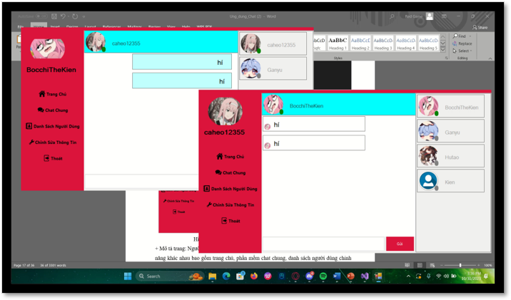

# Chat Application

A modern real-time chat application with user management and social features.

## Features

### Authentication
- User login system
- Secure authentication
- User logout functionality

### Main Features
1. **Home Page**
   - Clean and intuitive interface
   - Quick access to main features
   - User-friendly navigation

2. **Messaging**
   - Real-time chat functionality
   - Message history
   - User-to-user communication

3. **Friend Management**
   - Friend list management
   - Add/remove friends
   - View friend status

4. **Notifications**
   - Real-time notifications
   - System alerts
   - Message notifications

5. **User Reports**
   - Report system for inappropriate behavior
   - User complaint management

### Administrative Features
- Admin dashboard
- User management interface
- System monitoring
- User report handling

## User Interface

The application features a modern and responsive design with:
- Clean and intuitive navigation
- User-friendly message interface
- Easy-to-use friend management system
- Clear notification system
- Professional admin dashboard

## Screenshots

### Login Page

### Home Page

### Messaging Interface

### Friend List

### User List

### Notifications

### User Reports

### Admin Dashboard

### User Reports Management

### Logout

